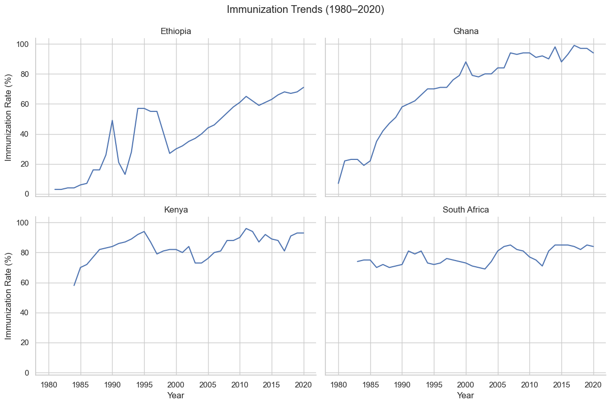

# Public Health Data ETL Pipeline (Sub-Saharan Africa)

## Introduction
This project builds a full ETL (Extract, Transform, Load) pipeline using public health data from the World Bank's Health Nutrition and Population Statistics database.  
It focuses on analyzing three key health indicators across four Sub-Saharan African countries from 1960 to 2023:
-  Life Expectancy at Birth
- Immunization Coverage (DPT3 vaccine)
- Maternal Mortality Ratio

This project reflects my interest in using data engineering to analyze public infrastructure, development, and social systems. I wanted to practice building a complete data pipeline- from messy raw files to a structured, clean database- while exploring how health outcomes have evolved over time across different regions of Africa.

## Dataset Information
- Source: [World Bank - Health Nutrition and Population Statistics](https://datacatalog.worldbank.org/search/dataset/0037652/Health-Nutrition-and-Population-Statistics)
- Format: Excel file (.xlsx) and JSON metadata
- Time Period: 1960–2023
- Countries Focused: Kenya, Ghana, South Africa, Ethiopia

---

## Technologies Used
- Python3
- Pandas
- SQLite3
- JSON
- Excel file handling ("openpyxl")

## How the Pipeline Works

1. **Extract**:
    - Read the Excel and JSON files containing public health data.

2. **Transform**:
    - Filtered data for the selected specific countries and indicators.
    - Reshaped the data into tidy format data (years as rows).
    - Dropped missing values and cleaned the dataset for effective analysis.

3. **Load**:
    - Saved the cleaned data to a `.csv` file.
    - Loaded the final data into an SQLite database table (`public_health_indicators`).

4. **Query**:
    - Wrote and ran SQL queries to analyze life expectancy immunization coverage, and maternal mortality trends over time.

## Visual Summaries**
1. **Total Records**

2. **Records per Country**

3. **Average Life Expectancy in 2020**

4. **Life Expectancy Trends (1960–2020)**

5. **Immunization Trends (1980–2020)**

6. **Maternal Mortality Trends (1990–2020)**

7. **Maternal Mortality Changes (1990–2020)**

8. **Top Immunization Country (2020)**

## Project Folder Structure

/Public Social Program ETL/ ├── data/ │ ├── Health Nutrition and Population Statistics.json │ ├── HNP_StatsEXCEL.xlsx │ ├── hnp_data_raw.csv │ ├── hnp_data_cleaned.csv │ ├── health_data.db ├── main.py ├── load.py ├── query.py ├── README.md

---

## Future Work
- Connect the database to a FastAPI server or a Streamlit dashboard for live data exploration.
- Visualize trends in Life Expectancy or Immunization Coverage.
- Expand analysis to additional countries or indicators.
- Automate ETL and querying pipeline with workflow tools (e.g., Apache Airflow).

## About Me
I'm Christa Ingabire, an early data professional passionate about using data to support public impact, development, and global systems.  
You can find me here: [GitHub](https://github.com/christaingabire)

